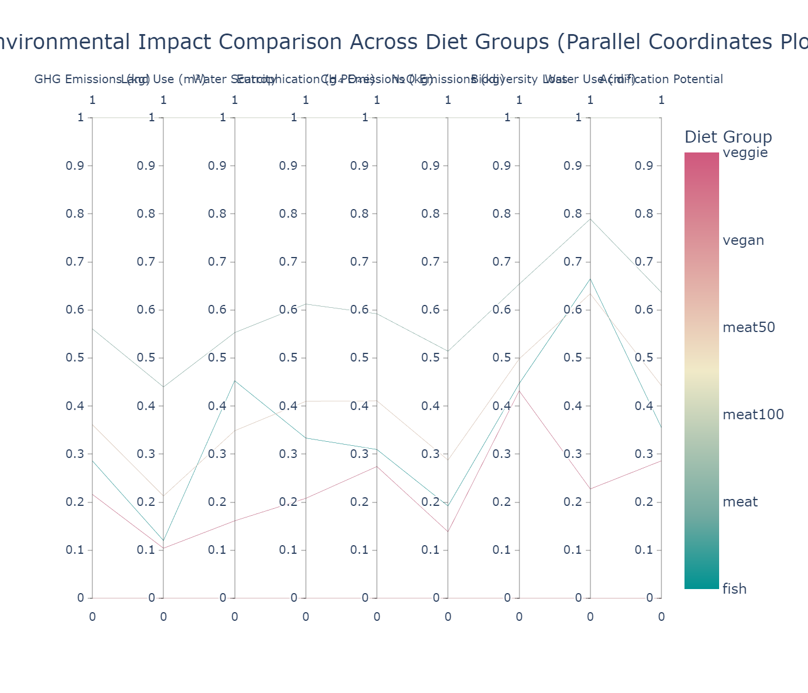

# comp4037-cw2-dataviz
Coursework 2 - Data Visualization for Diet &amp; Environment
# COMP4037 Coursework 2 – Data Visualization

This repository contains the code and output figure for a parallel coordinates plot comparing the environmental impact of six diet groups across nine ecological indicators.

## 📊 Visualization Summary

- **Design Type**: Parallel Coordinates Plot  
- **Tool**: Python (Plotly Express)  
- **Dataset**: UK diet and environmental impact dataset (Scarborough et al., 2023, *Nature Food*)  
- **Variables**: GHG emissions, land use, water scarcity, eutrophication, CH₄, N₂O, biodiversity loss, water use, acidification potential  
- **Diet Groups**: Vegan, Vegetarian, Fish-eater, Meat-eater, Meat50, Meat100

## 🔍 Key Insight

Vegan and vegetarian diets consistently have the lowest overall environmental impact across most indicators. However, vegetarian diets show higher water scarcity and eutrophication than fish-based diets — a trade-off not visible from simple charts but revealed through multivariate visualization.

## 🖼️ Preview

## 📁 Files

- `main.py`: Python script for data processing and visualization  
- `diet_environment_parallel_coordinates.png`: Output image for coursework submission  
- `requirements.txt`: Python libraries used in the project

## 🧾 Author

Coursework submitted by Qing Wang for COMP4037: Research Methods in Data Science.
